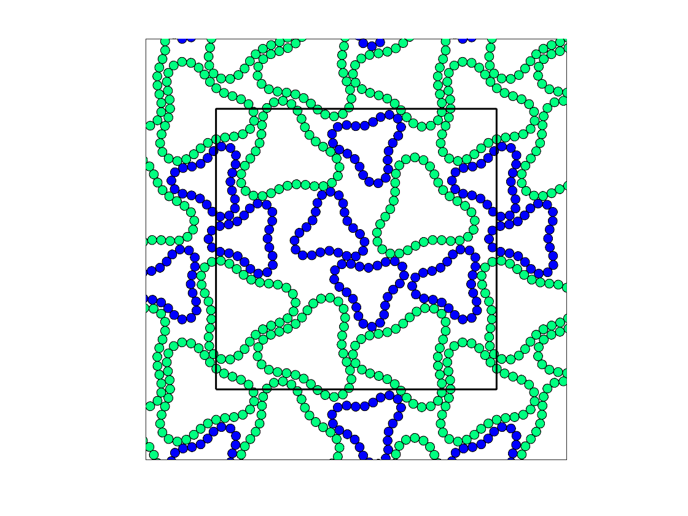

# dpm 
By Jack Treado, Yale University

Welcome to the Deformable Particle Model (DPM)!

This code broadly allows for the simulation of deformable particles. Currently (as of 06/08/21) the code can only support 2D particles, but 3D is on the way!

References that use the DPM:

J. D. Treado, D. Wang, A. Boromand, M. P. Murrell, M. D. Shattuck, and C. S. O'Hern, "Bridging particle deformability and collective response in soft solids," _Phys. Rev. Materials_ **5** 055605 (2021).

A. Boromand, A. Signoriello, J. Lowensohn, C. S. Orellana, E. R. Weeks, F. Ye, M. D. Shattuck, and C. S. O'Hern, "The role of deformability in determining the structural and mechanical properties of bubbles and emulsions," _Soft Matter_ **15** 5854 (2019).

A. Boromand, A. Signoriello, F. Ye, C. S. O'Hern, and M. D. Shattuck, "Jamming of deformable polygons," _Phys. Rev. Lett._ **121** 248003 (2018).

## Getting started

Once the code has been downloaded, the code can be compiled using the `g++` compiler with the `--std=c++11` flag.

Specific simulations are stored in the `main` directory, which all use code written in the `src` directory.

To compile a given simulation to a binary (say `bin.o`), make the `dpm` directory your working directory and use:

`g++ -O3 --std=c++11 -I src main/[DIR NAME]/[MAIN FILE NAME].cpp src/*.cpp -o bin.o`

## Example: Jam bidisperse deformable particles with sinusoidal preferred angle profiles

Using the main file `main/jam/bidisperseSinusoidalParticleJamming`, you can generate jammed packings (at a specified pressure) of bidisperse, purely repulsive, deformable particles with lobed shapes sets by a sinusoidally-varying preferred angle profile. 

See some example jammed configurations below.

  
   

Once you compile using the command above, run the code using the generated binary file. The input parameters are:
* `NCELLS`: integer number of particles
* `nsmall`: integer number of vertices on small particles, `n` on large particles is set by the 1.4:1.0 size ratio. 
* `calA0`: **preferred** shape parameter of all particles
	* defined as `calA0 = p_0^2/(4 * pi * a_0)`, where `p_0` and `a_0` are the preferred perimeter and areas of the particles, respectively
	* Note that input `calA0` should be greater than or equal to 1 always. 
* `kl`: mechanical constant for perimeter
* `kb`: mechanical constant for curvature
* `thA`: amplitude of sinusoidal preferred angles
* `thK`: wavenumber of sinusoidal preferred angles
* `Ptol`: pressure tolerance, jammed configs with final pressure `P` satisfy `Ptol  < P < 2 * Ptol`
* `Ftol`: force tolerance of energy minimization protocol
* `seed`: integer to seed random number generator
* `positionFile`: path to file to store position data for jammed configuration. 

To generate the above image on the left, run the compiled binary `bin.o` using

`./bin.o 12 24 1.04 1.0 0.01 3.0 3.0 1e-7 1e-12 1 pos.test`

`./bin.o 12 24 1.20 1.0 0.01 10.0 3.0 1e-7 1e-12 1 pos.test`

