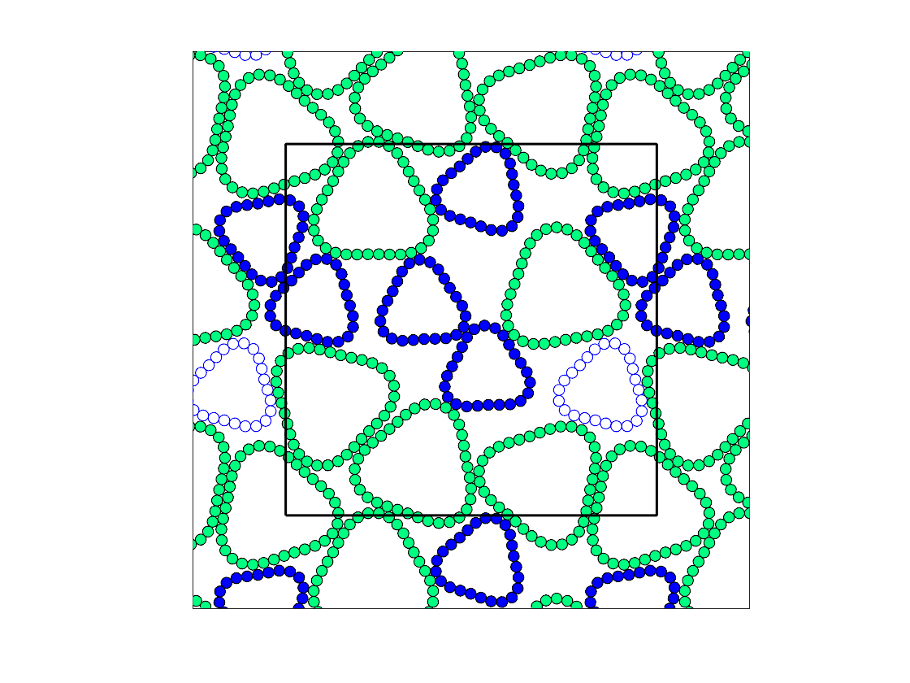
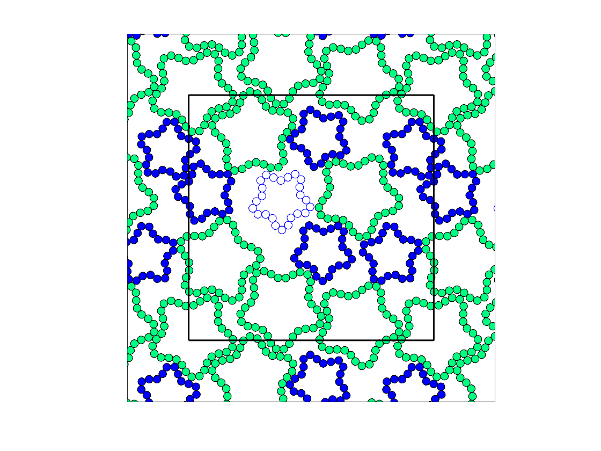

# Getting Started 
By Jack Treado, Yale University

Welcome to the Deformable Particle Model (DPM)!

This repository broadly allows for the simulation of deformable particles. Currently (as of 06/08/21) we only support 2D particles, but 3D is on the way!

References that use the DPM:

J. D. Treado, D. Wang, A. Boromand, M. P. Murrell, M. D. Shattuck, and C. S. O'Hern, "Bridging particle deformability and collective response in soft solids," _Phys. Rev. Materials_ **5** 055605 (2021).

A. Boromand, A. Signoriello, J. Lowensohn, C. S. Orellana, E. R. Weeks, F. Ye, M. D. Shattuck, and C. S. O'Hern, "The role of deformability in determining the structural and mechanical properties of bubbles and emulsions," _Soft Matter_ **15** 5854 (2019).

A. Boromand, A. Signoriello, F. Ye, C. S. O'Hern, and M. D. Shattuck, "Jamming of deformable polygons," _Phys. Rev. Lett._ **121** 248003 (2018).

## Compilation

Once the repository has been downloaded, any code can be compiled using the `g++` compiler with the `--std=c++11` flag.

Specific simulations are stored in the `main` directory, which all use files written in the `src` directory.

To compile a given simulation to a binary (say `bin.o`), make the `dpm` directory your working directory and use:

`g++ -O3 --std=c++11 -I src main/[DIR NAME]/[MAIN FILE NAME].cpp src/*.cpp -o bin.o`

# Example: Jam bidisperse deformable particles with sinusoidal preferred angle profiles

Using the main file `main/jam/bidisperseSinusoidalParticleJamming`, you can generate jammed packings (at a specified pressure) of bidisperse, purely repulsive, deformable particles with lobed shapes sets by a sinusoidally-varying preferred angle profile. 

See some example jammed configurations below.

  
   

## Compilation inputs

Once you compile the main file, run the simulation using the generated binary file. The input parameters are:
* `NCELLS`: integer number of particles
* `nsmall`: integer number of vertices on small particles, `n` on large particles is set by the 1.4:1.0 size ratio. 
* `calA0`: **preferred** shape parameter of all particles
	* defined as `calA0 = p_0^2/(4 * pi * a_0)`, where `p_0` and `a_0` are the preferred perimeter and areas of the particles, respectively
	* Note that input `calA0` should be greater than or equal to 1 always. 
* `kl`: mechanical constant for perimeter
* `kb`: mechanical constant for curvature
* `thA`: amplitude of sinusoidal preferred angles
* `thK`: wavenumber of sinusoidal preferred angles (**sets number of lobes**)
* `Ptol`: pressure tolerance, jammed configs with final pressure `P` satisfy `Ptol  < P < 2 * Ptol`
* `Ftol`: force tolerance of energy minimization protocol
* `seed`: integer to seed random number generator
* `positionFile`: path to file to store position data for jammed configuration. 

To generate the above images, run a compiled binary `bin.o` using:

* _left_: `./bin.o 12 24 1.04 1.0 0.01 3.0 3.0 1e-7 1e-12 1 pos.test`

* _right_: `./bin.o 12 24 1.20 1.0 0.01 10.0 5.0 1e-7 1e-12 1 pos.test`

## Output

The final input to the main file, `positionFile`, will store the positions of all vertices in the jammed state as well as some other useful information about the state of the system. 

Each row in this file starts with a five-character keyword that denotes what information that row contains. The keywords are:
* `NEWFR`: starts this particular frame. If the code prints multiple configurations, this can be used to identify the start of a new configuration.
* `NUMCL`: number of cells
* `PACKF`: packing fraction (particle areas / box area)
* `BOXSZ`: box lengths `Lx` and `Ly`
* `STRSS`: components of the virial stress tensor, sorted as `Sxx`, `Syy`, `Sxy`
* `CINFO`: information about cell
* `VINFO`: information about vertex 

###CINFO 

There is one `CINFO` row per cell. For a given cell `mu`, the row is formatted as:

`CINFO` `nv` `zc` `zv` `a0` `a` `p`

where
* `nv` number of vertices on cell `mu`
* `zc` number of cell-cell contacts on cell `mu`. 
* `zv` number of vertex-vertex contacts on cell `mu`.
* `a0` preferred area of cell `mu`
* `a` instantaneous area of cell `mu`
* `p` instantaneous perimeter of cell `mu`

###VINFO

There is also one `VINFO` row per vertex. For a given vertex `i` on cell `mu`, the row is formatted as:

`CINFO` `mu` `i` `x` `y` `r` `l0` `t0`

where `mu` and `i` refer to the cell and vertex indices, respectively, and
* `x`: x coordinate of vertex
* `y`: y coorindate of vertex
* `r`: radius of vertex
* `l0`: preferred length of edge between vertices `i` and `i+1`
* `t0`: preferred angle for angle centered on vertex `i`

